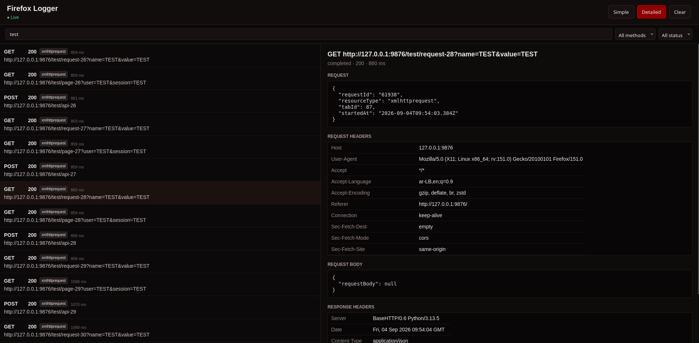

# firefox logger

firefox logger is a firefox activity and network logging tool built with typescript, node.js, sqlite, and a firefox extension.



## features

- firefox activity logging
- network request and response logging
- http transaction tracking
- event and transaction filtering
- live event streaming
- sqlite storage
- web interface
- firefox native messaging
- automated tests

## requirements

- linux
- firefox
- node.js
- npm

## installation

```bash
sudo apt update
sudo apt install git nodejs npm
git clone https://github.com/your-name/firefox-logger.git
cd firefox-logger
npm install
npm run build
npm run install-host
```

## firefox extension

open firefox and go to:

`about:debugging#/runtime/this-firefox`

click `load temporary add-on...` and select:

`extension/manifest.json`

## usage

start the server:

```bash
npm run server
```

open:

`http://127.0.0.1:8765`

## development

```bash
npm run dev
npm run build
npm run server
npm run install-host
npm test
```

## project structure

```text
firefox-logger/
├── .gitignore
├── extension/
│   ├── background.js
│   ├── manifest.json
│   ├── sanitizer.js
│   └── types.js
├── native-host.sh
├── package.json
├── package-lock.json
├── public/
│   ├── app.js
│   ├── index.html
│   └── style.css
├── scripts/
│   └── install-host.sh
├── src/
│   ├── cli/
│   │   ├── main.ts
│   │   ├── native-host.ts
│   │   └── server.ts
│   ├── config/
│   │   └── logging-mode.ts
│   ├── core/
│   │   ├── event-manager.ts
│   │   ├── event-stream.ts
│   │   ├── filter.ts
│   │   ├── http-transaction.ts
│   │   ├── live-stream.ts
│   │   ├── logger.ts
│   │   ├── transaction-manager.test.ts
│   │   ├── transaction-manager.ts
│   │   └── types.ts
│   ├── extension/
│   │   ├── background.ts
│   │   ├── manifest.json
│   │   ├── sanitizer.ts
│   │   └── types.ts
│   ├── firefox/
│   │   ├── capture.test.ts
│   │   ├── capture.ts
│   │   ├── connector.ts
│   │   ├── event-mapper.ts
│   │   ├── native-host.ts
│   │   ├── native-messaging.ts
│   │   └── types.ts
│   ├── server/
│   │   ├── http-server.ts
│   │   ├── live-client.ts
│   │   ├── live-server.test.ts
│   │   └── live-server.ts
│   └── storage/
│       ├── database.ts
│       ├── filter-sql.ts
│       ├── query.ts
│       ├── repository.ts
│       ├── transaction-filter-sql.ts
│       └── transaction-repository.ts
├── tests/
│   ├── core/
│   │   ├── event-manager.test.ts
│   │   ├── filter.test.ts
│   │   └── logger.test.ts
│   ├── firefox/
│   │   ├── capture.test.ts
│   │   ├── connector.test.ts
│   │   ├── event-mapper.test.ts
│   │   ├── native-host.test.ts
│   │   └── native-messaging.test.ts
│   └── storage/
│       ├── filter-sql.test.ts
│       ├── repository-filter.test.ts
│       ├── repository.test.ts
│       └── transaction-repository.test.ts
├── tsconfig.json
└── vitest.config.ts
```

## tests

```bash
npm test
```

## license

ISC
